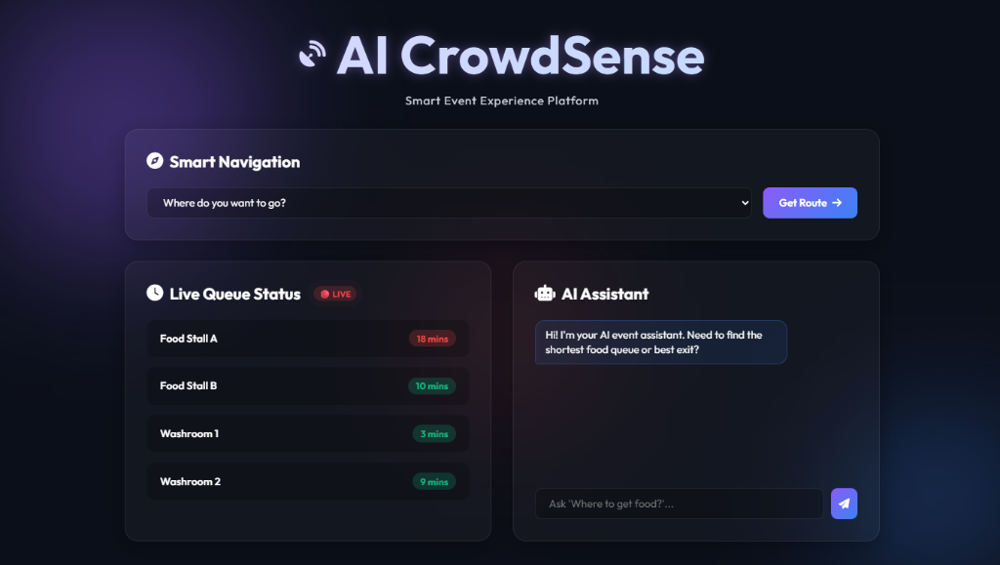
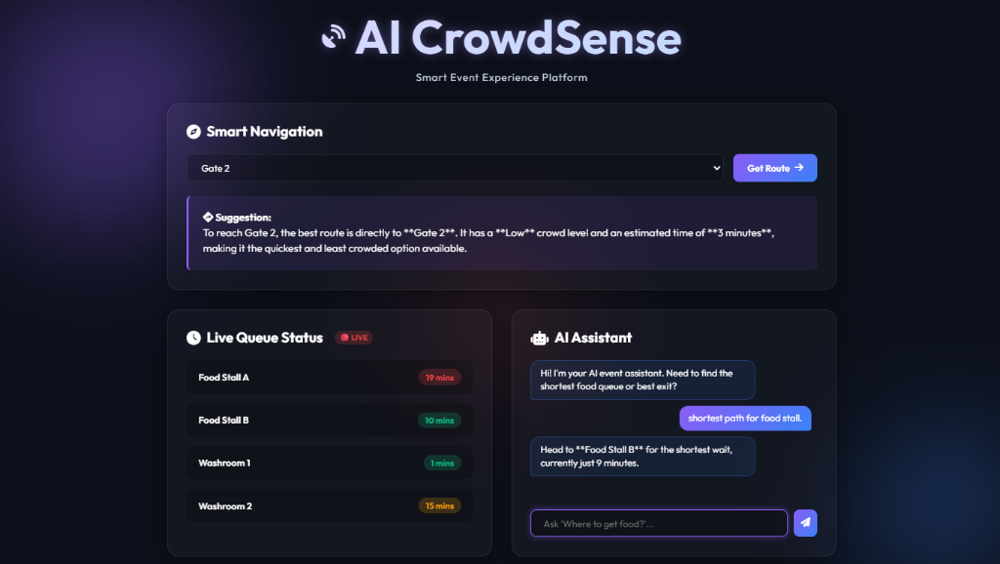

# 🧠 AI CrowdSense - Smart Event Experience Platform

[](https://python.org/)
[](https://fastapi.tiangolo.com)
[](https://aistudio.google.com/)
[](https://github.com/ayus1234/AI-CrowdSense/actions/workflows/test.yml)

### 🔴 **[Live Demo: Play with AI CrowdSense Online](https://ai-crowdsense-15593284604.europe-west1.run.app)** 🔴

**AI CrowdSense** is a smart, real-time venue navigation and queue prediction system designed to dramatically improve the attendee experience at large-scale events (sports stadiums, concerts, airports, and malls).

## 📸 Application Interface
<div align="center">
  
  
</div>

## 🏆 Problem Addressed
At large sporting events, attendees waste enormous amounts of time stuck in bottlenecks, standing in massive queues for food or washrooms, and struggling to navigate. This leads to frustrated fans and unequal distribution of crowds for vendors.

## 🚀 Our Solution
**AI CrowdSense** fixes this chaos by actively analyzing crowd density and providing intelligent recommendations via Google Gemini's advanced LLM.
1. **🧭 Smart Navigation:** Dynamically updates routes to avoid physical bottlenecks.
2. **⏱ Live Queue Prediction:** Re-routes fans dynamically based on which food stalls have the shortest waiting times.
3. **🤖 Automated AI Assistant:** Acts as a proactive "traffic controller", answering user questions while implementing **Bias-Aware route balancing** to prevent creating *new* bottlenecks at popular vendors.

## ✨ Features
* **Premium Glassmorphism UI:** Stunning, responsive front-end designed to wow judges and users alike.
* **Bias-Aware Recommendation Logic:** Doesn't just blindly send everyone to the shortest queue. Gemini actively distributes traffic to balance the crowd flow across the entire venue.
* **Live Simulated Data Engine:** Replicates real-time stadium metrics on a backend loop.
* **Dynamic Animations:** Features an AI welcome message typing effect, engineered AI 'thinking' delays for premium UX, interactive queue row hovers, custom pulsing 'LIVE' badges, and bright projector-optimized contrast styling.
* **Fully Responsive:** Beautifully adapts from 4K ultrawide monitors down to 400px mobile phones.
* **Enterprise Grade:** Built with dynamic `GZip` compression, rigorous Pydantic input validation, strict HTTP security headers, comprehensive `pytest` coverage, and ARIA-compliant screen-reader accessibility integrations.
* **Smart Caching:** Intelligent `Cache-Control` headers that aggressively cache static assets (`max-age=86400`) while enforcing zero-cache (`no-store`) on real-time API endpoints.
* **CI/CD Pipeline:** Automated testing via GitHub Actions on every push to `main`, ensuring continuous code quality.

## 🛠️ Technology Stack
* **Frontend Layer:** HTML5, CSS3, Vanilla JavaScript, Google Firebase Analytics & Auth
* **Backend Framework:** Python FastAPI, Pydantic, GZipMiddleware
* **Testing & CI/CD:** Pytest, HTTPX, GitHub Actions
* **Google Cloud Ecosystem:** Gemini 2.5 Flash API, Cloud Storage
* **Deployment System:** Cloud native, Dockerized for Google Cloud Run (Single-container architecture)

## 💻 Running the App Locally

### 1. Prerequisites Ensure you have Python 3.10+ installed.

### 2. Add API Key
Create a `.env` file in the root directory and add your Google Studio API key:
```ini
GEMINI_API_KEY="your-api-key-here"
```

### 3. Install Requirements
```bash
python -m venv venv
.\venv\Scripts\activate
pip install -r backend/requirements.txt
```

### 4. Run Tests
```bash
pytest backend/test_api.py
```

### 5. Run the Engine
```bash
python backend/app.py
```
*Navigate to `http://localhost:8080` to interact with the live CrowdSense Dashboard!*

## 🔮 Future Scope

* **📷 IoT Integration:** Replace simulated data with real-time crowd counting via live camera feeds.
* **🤝 Vendor Partnerships:** Monetize through data insights and sponsored visibility for food/retail stalls.
* **📱 Mobile App:** Native iOS & Android app for attendees and a venue-management dashboard.

## 🎯 Conclusion

AI CrowdSense redefines event management by transforming passive crowd monitoring into active, intelligent navigation. By leveraging Gemini's real-time analytical capabilities, the platform not only eliminates physical bottlenecks but also creates a seamless, enjoyable experience for attendees while unlocking new operational efficiencies for event organizers.

---
*Built for the 2026 AI Innovation Hackathon. Stop standing in lines, start enjoying the event.*
